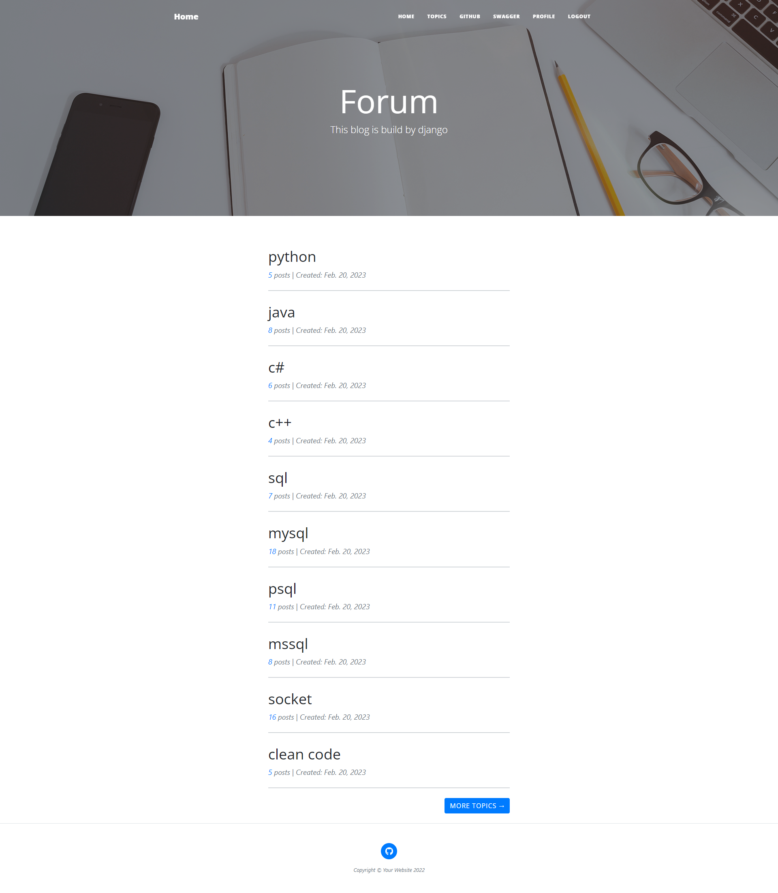
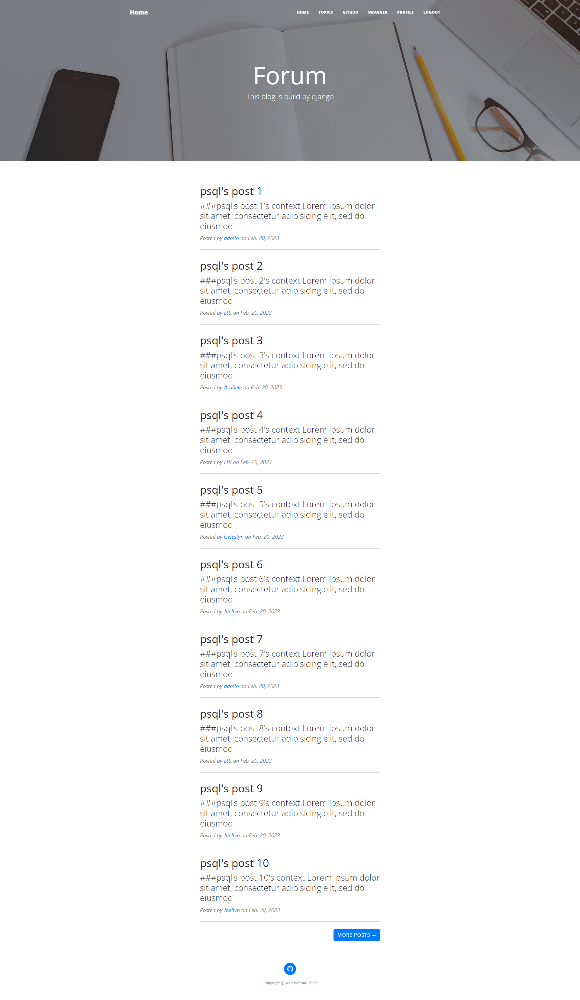
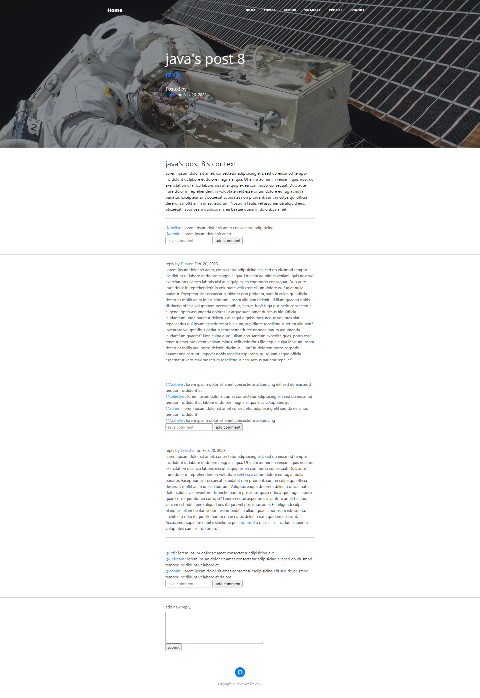
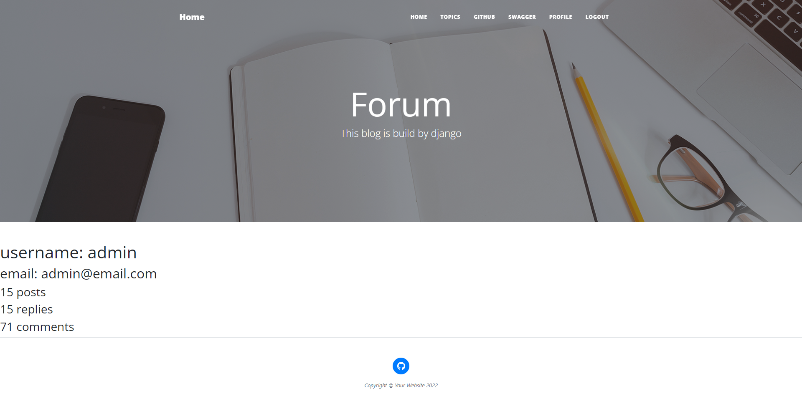
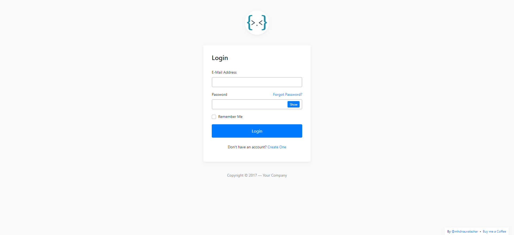
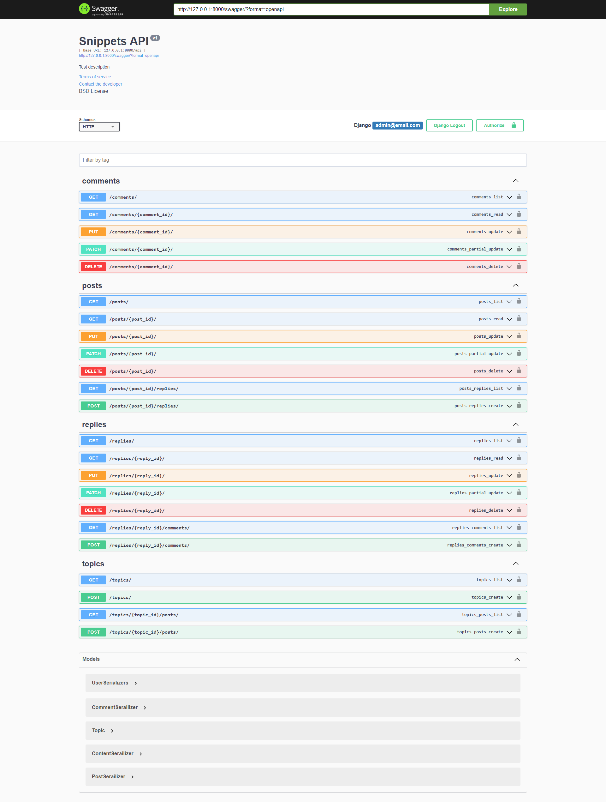

### preview








### Install

```
git clone https://github.com/k4Y53N/forum.git
cd forum
```


### Setup
```
mkdir mount/db
mkdir mount/backend
echo "<your database name>" > secrets/db_name.txt
echo "<your database password>" > secrets/db_password.txt
echo "<your database username>" > secrets/db_username.txt
echo "<your django secret key>" > secrets/secret_key.txt
```


### Strat Up
```
docker-compose up -d
```

### ref
[https://github.com/nauvalazhar/bootstrap-4-login-page](https://github.com/nauvalazhar/bootstrap-4-login-page)  
[https://github.com/StartBootstrap/startbootstrap-clean-blog](https://github.com/StartBootstrap/startbootstrap-clean-blog)


### swagger api
[127.0.0.1/swagger/](127.0.0.1/swagger/)
